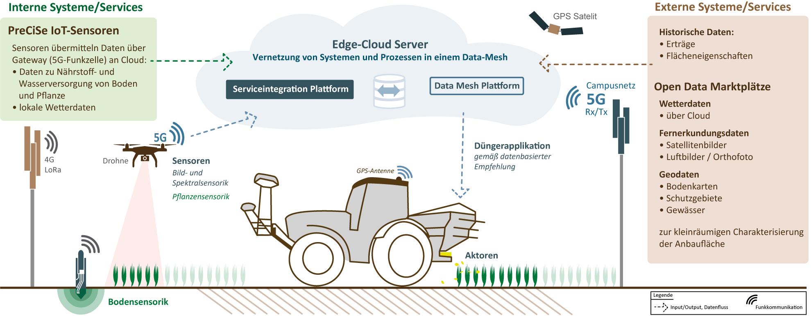

# 5G-PreCiSe

## Projekt

Das Projekt untersucht das Potenzial von 5G für die smarte Düngung in der Landwirtschaft, mit dem Ziel, eine ressourceneffiziente, bedarfsorientierte und teilflächenspezifische Düngerausbringung zu ermöglichen. Dabei werden Sensoren eingesetzt, die Umwelt- und Pflanzendaten sowohl vor als auch während des Düngevorgangs erfassen. Diese Daten werden in Echtzeit an die Edge-Cloud übertragen, die das zentrale Element der 5G-PreCiSe-Umgebung bildet. Hier werden unter Einbeziehung weiterer Datenquellen, wie Satellitenbildern und historischen Daten, sowie durch Simulationsmodelle die optimalen Düngebedarfe für die aktuelle Managementzone berechnet. Die berechneten Informationen werden dann an die Landmaschine zurückgespielt, um die Düngung anzupassen.

Für diesen Echtzeit-Prozess ist 5G als schnelles Kommunikationsmedium notwendig. Die smarte Düngung wird als Beispielanwendung genutzt, um die grundlegenden Konzepte der Vernetzung von Sensoren, Aktoren, Datenquellen, Cloud-Services und Simulationsmodellen in einem Data-Mesh zu entwickeln, die später auf andere landwirtschaftliche Anwendungen angewendet werden können.

# Projektpartner

 

# SMT LoRa Controller

Dieses Repository enthält die Dokumentation für einen ESP32-basierten LoRaWAN-Controller zur Anbindung von SMT100 Bodenfeuchtesensoren über RS485. Der Controller unterstützt bis zu acht Sensoren und kann je nach Modus energieeffizient im Deep-Sleep arbeiten oder dauerhaft online bleiben. Die Konfiguration erfolgt über WiFi und HTTP.

Das Projekt wird für die präzise Bodenüberwachung in der Landwirtschaft eingesetzt. 
Mehr Details im Repository: [SMT-LoRa-Controller Repository](https://github.com/5G-PreCiSe/SMT-LoRa-Controller)

# Edge-to-Cloud File Uploader HAT
Dieses Repository enthält die Dokumentation für einen Raspberry Pi HAT, der mit der 5G PreCiSe Edge-to-Cloud File Uploader PCB kompatibel ist. Das HAT ermöglicht eine einfache Bedienung über vier Tasten und ein 0,96" OLED-Display, das Menüführung, Konfigurationsparameter und den Upload-Status anzeigt. Ein 30x30 mm Lüfter sorgt für Kühlung.

Mehr Details im [Edge-to-Cloud File Uploader HAT Repository.](https://github.com/5G-PreCiSe/edge-to-cloud-file-uploader-hat)

# Edge-to-Cloud File Uploader
Dieses Repository enthält den Quellcode eines Python-Tools zum Hochladen von Dateien aus einem lokalen Verzeichnis in ein S3-Storage. Ursprünglich wurde es für das Hochladen von Drohnenaufnahmen über eine 5G-Verbindung entwickelt. Das Tool läuft auf einem headless Raspberry Pi und kann per MQTT API ferngesteuert werden.

Mehr Details im [Edge-to-Cloud File Uploader Repository.](https://github.com/5G-PreCiSe/edge-to-cloud-file-uploader)

# DGX-A100 IPMI Monitoring
Dieses Repository enthält ein Python-Tool zur Überwachung der Temperatur-Sensoren eines Nvidia DGX A100 Servers über IPMI. Die erfassten Daten werden per MQTT veröffentlicht.

Mehr Details im [DGX-A100 IPMI Monitoring Repository.](https://github.com/5G-PreCiSe/DGX-A100-IPMI-Monitoring)

# Datenprodukte
Dieses Repository enthält Datenprodukte für die Analyse und Visualisierung landwirtschaftlicher Daten, darunter NDVI-Clustering, Umwandlung von multispektral Bildern zu NDVI/LAI Bilddateien und Applikationskarten zur präzisen Düngeverteilung. Ziel ist es, durch datengetriebene Ansätze die Entscheidungsfindung in der Präzisionslandwirtschaft zu unterstützen.

Mehr Details im [Datenprodukte-Repository.](hier Link dann einfügen)

